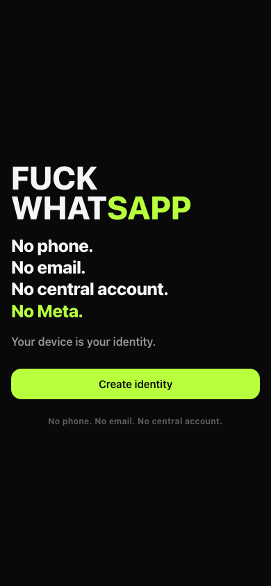
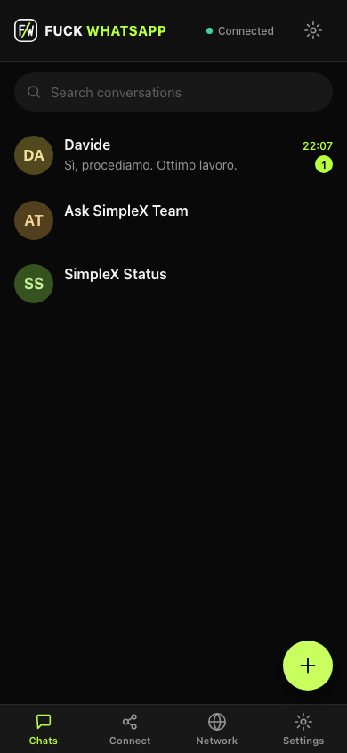
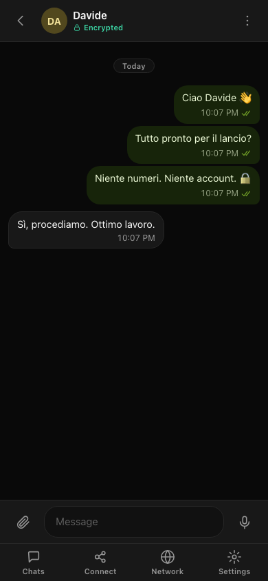
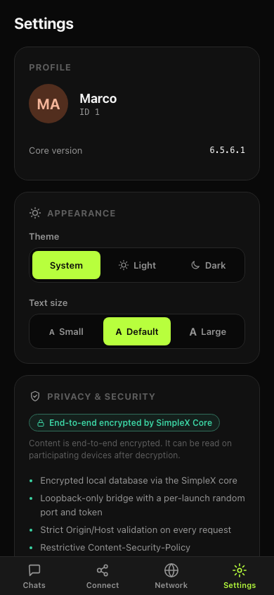
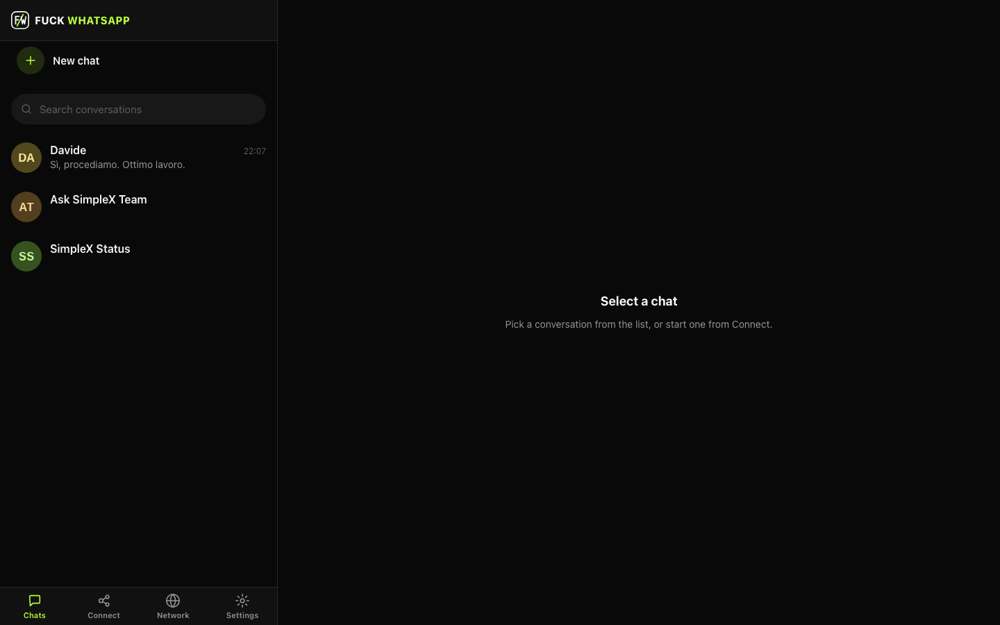
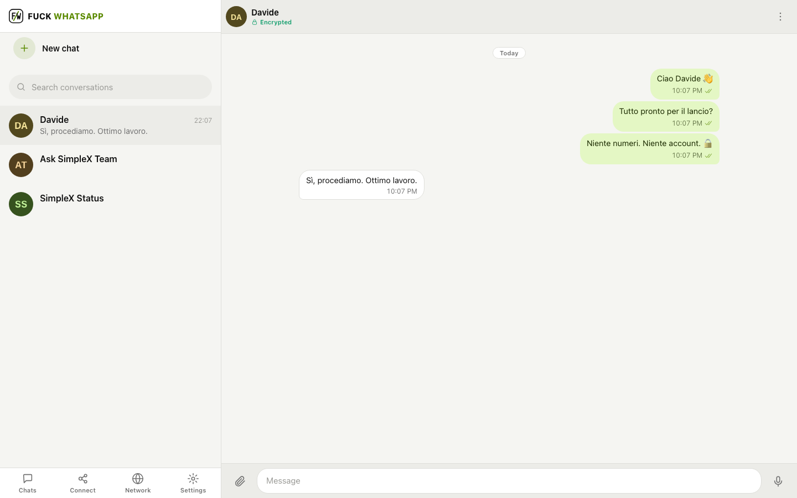
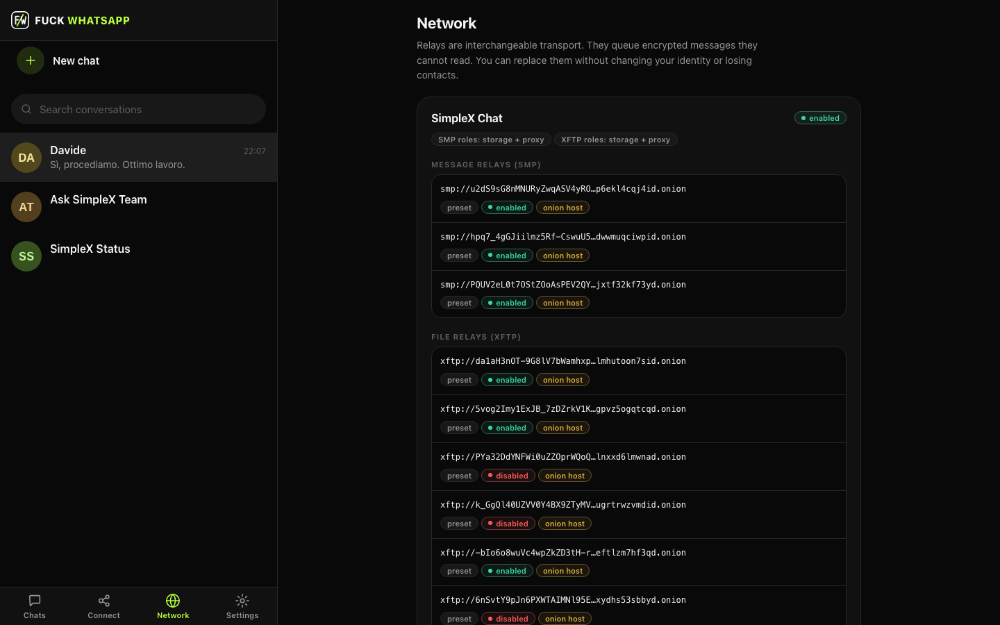
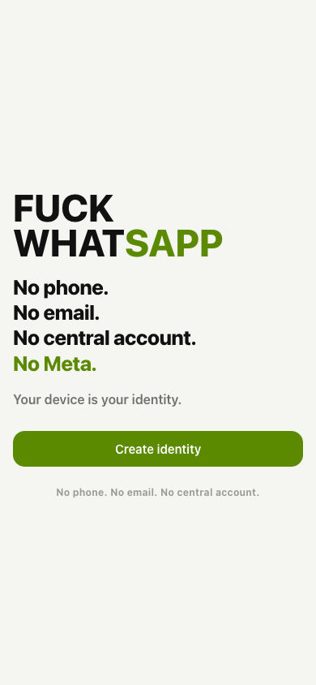

<div align="center">


# FUCK WHATSAPP

**A local-first, open-source messaging app built on the [SimpleX](https://github.com/simplex-chat/simplex-chat) messaging protocol.**

_Your messages. Your device. Your choice._

**[⬇ Download](#download)** ·
[Why this exists](#why-this-exists) ·
[How it works](#how-it-works) ·
[Features](#features) ·
[Security](#security) ·
[Build from source](#build-from-source)

[](https://github.com/andreainzaghi/fuck_whatsapp/actions/workflows/ci.yml)
[](https://github.com/andreainzaghi/fuck_whatsapp/actions/workflows/codeql.yml)

`AGPL-3.0` · `SimpleX Chat core v6.5.6` · `Local-first` · `No telemetry` · `v0.1.0 (early)`

<sub>The badges above are served by GitHub itself — this README loads no third-party or tracking images.</sub>

</div>

---

FUCK WHATSAPP (FWA) is an independent, open-source messaging app for people who
do not want their identity, contacts, and private conversations owned by a
centralized platform. It runs on your own machine and opens in your browser. It
requires no phone number, no email address, and no account with anyone.

**Read this honestly:** FWA does **not** operate its own central messaging
backend. It uses a local application core and the open **SimpleX** messaging
network. Messages are encrypted end-to-end by the SimpleX core and are decrypted
on the participating devices. The relays that carry your traffic move ciphertext
— but, like any network, they can observe some transport metadata (see
[Privacy](#privacy) and [Threat model](#threat-model)).

> This is early-stage software (**v0.1.0**). One platform is verified on real
> hardware today (macOS Apple Silicon); the rest are prepared in CI and not yet
> hardware-verified. Builds are currently **unsigned**. We say so plainly
> throughout — no marketing, no absolute-security claims.

<div align="center">

### See it in action


<sub>Real app, disposable test profiles. Create an identity → share a one-time invitation → chat. No phone number, no account, no sign-up.</sub>

</div>

---

## Why this exists

Personal communication should not require permission from a corporation.

To speak privately with another human being, you should not have to hand a
company:

- a phone number,
- an email address,
- an advertising identity,
- your address book,
- a social graph,
- permanent behavioral metadata,
- or a central account it owns and can revoke.

That is the arrangement most mainstream messengers normalize. FWA is a small,
concrete refusal of it: an interface to a serious open protocol, running on your
device, under your control.

---

## The manifesto

We are not building another account inside another company.

We are not asking for your phone number.

We are not uploading your address book.

We are not building an advertising profile.

We are not creating a central database of relationships.

We are not asking Meta, Google, or Apple for permission to let two people speak.

Your device is not an advertising terminal.
Your contacts are not a growth graph.
Your conversations are not training data.
Your identity is not a row in a corporate database.

**Communication is infrastructure for human freedom.**

It should be open.
It should be portable.
It should be private.
It should not have an owner.

---

## Why now?

Confidential communication is under steady political and commercial pressure, and
the debate is unusually live in Europe right now.

The EU's **temporary ePrivacy derogation** — the interim rule that lets
providers *voluntarily* detect child sexual abuse material (CSAM) in some
communications — lapsed in **April 2026**, and the institutions have been
renegotiating its renewal. In its **July 2026 plenary session**, the European
Parliament adopted its position on the renewal. Crucially, the Parliament's
position holds that voluntary detection must stay **proportionate and targeted**
and must **not apply to end-to-end encrypted communications**. The **Council**
adopted its own first-reading position on **2 July 2026**. The two institutions
still have to reconcile their texts, so **this is not final law** — and the
separate, permanent **CSAM Regulation** (the 2022 “Child Sexual Abuse
Regulation” proposal) remains its own ongoing legislative process.

Our position is simple and, we think, not controversial:

> Children deserve effective, targeted protection. Everyone also deserves
> confidential communication. A serious society defends both, and does not treat
> every private conversation as presumptively suspicious.

The larger point outlasts any single vote: whether confidential communication
stays a normal part of democratic life, or becomes a conditional privilege
granted by governments and platforms. Tools that keep private communication
*possible* — open, portable, and not owned by one company — are part of the
answer either way.

**Verify the current legal status yourself** — it can change, and headlines are
often wrong. As of **10 July 2026**, primary sources:

- European Parliament — [child sexual abuse online: extending the interim rules](https://www.europarl.europa.eu/news/en/press-room/20260306IPR37531/child-sexual-abuse-online-support-for-extending-rules-until-august-2027)
  and the [July 2026 plenary vote on reinstating the ePrivacy derogation](https://www.europarl.europa.eu/news/en/agenda/plenary-news/2026-07-06/13/combating-child-sexual-abuse-online-vote-to-reinstate-eprivacy-derogation)
- Council of the EU — [first-reading position (2 July 2026)](https://data.consilium.europa.eu/doc/document/ST-11261-2026-REV-1/en/pdf)
- EUR-Lex — [proposal for the long-term CSAM Regulation (2022)](https://eur-lex.europa.eu/legal-content/EN/TXT/?uri=celex:52022PC0209)

_This section is a pointer to primary sources, not legal advice. Nothing here
should be read as a final statement of enacted EU law._

---

## What is FUCK WHATSAPP?

- An **independent, open-source messaging client** — not an official product of
  SimpleX, WhatsApp, or anyone else.
- It runs **locally** on your computer. The launcher serves the web UI on
  `127.0.0.1` (loopback) and opens it in your default browser.
- The **official, unmodified SimpleX Chat core** handles messaging and all
  encryption. FWA implements **no cryptography of its own**.
- Your data — the **encrypted database** and received files — is stored **on your
  device**, in your OS app-data directory.
- **SimpleX relay servers** transport encrypted packets. They are transport, not
  a FWA service, and they are **configurable** by you.
- There is **no FWA user database**, and **no phone number or email** is required
  as a global identity.

---

## How it works

```text
Your device
    │
    │ end-to-end encrypted message
    ▼
SimpleX relay
    │
    │ end-to-end encrypted message
    ▼
Recipient's device
```

On your machine, the pieces fit together like this:

```text
┌──────────────────────── your computer ─────────────────────────┐
│                                                                 │
│  Browser UI  ──HTTP + WebSocket, 127.0.0.1 only──►  Launcher    │
│  (React, served locally)     one-time token,        + bridge    │
│                              HttpOnly cookie, CSP   (Node)       │
│                                                       │         │
│                                          spawns + supervises    │
│                                                       ▼         │
│                         official SimpleX Chat core (127.0.0.1)  │
│                         all encryption · SQLCipher database     │
└──────────────────────────────┬──────────────────────────────────┘
                               │ encrypted traffic only
                               ▼
                  SimpleX relays  (transport you can replace)
```

The relay acts as a transport mechanism. **It does not receive the keys required
to decrypt the conversation content.**

Be precise about metadata: relay and network operators may still observe
**transport metadata** such as connection timing, IP addresses, and traffic
volume. **End-to-end encryption protects content, not every possible form of
metadata.**

---

## Why SimpleX?

[SimpleX](https://github.com/simplex-chat/simplex-chat) is an open-source
messaging protocol and software ecosystem with an unusual design goal: it avoids
a **universal user identifier**. Instead of a phone number or a global username,
connections are built from separate messaging queues and connection addresses.
Its core handles the cryptographic messaging; you can use community-run servers
or configure your own.

We integrate SimpleX because:

- It is a **serious open protocol** with a real security model and public review.
- FWA does **not invent its own encryption**.

> We would rather integrate a serious open protocol than invent
> “military-grade encryption” in a weekend.

**Attribution.** FWA ships the **official, unmodified SimpleX Chat CLI v6.5.6**
(© SimpleX Chat Ltd and contributors, AGPL-3.0), pinned by SHA-256. FWA is
**independent and not an official SimpleX product**, and does not use the SimpleX
name or logo as its own branding. See
[`docs/LICENSE_COMPLIANCE.md`](docs/LICENSE_COMPLIANCE.md),
[`THIRD_PARTY_NOTICES.md`](THIRD_PARTY_NOTICES.md), and the corresponding source
at the upstream tag [`v6.5.6`](https://github.com/simplex-chat/simplex-chat/tree/v6.5.6).

---

## Features

Only features that actually exist in this repository are listed.

### Available now

- [x] Local profile creation — **no phone number, no email**
- [x] Encrypted local database (SQLCipher, created encrypted from the first byte)
- [x] One-time contact invitations — shareable link **and** QR code
- [x] Accept an invitation by paste or by scanning a QR
- [x] Direct 1:1 conversations
- [x] Text messages (multiline, Unicode emoji)
- [x] Images, files, and voice messages
- [x] Delivery status indicators
- [x] Dark mode and light mode
- [x] Responsive layouts for mobile and desktop
- [x] Configurable SimpleX servers (view / add / reset), with a Tor-via-SOCKS option
- [x] “Lock and close” — locks the database and shuts the app down cleanly
- [x] **macOS Apple Silicon** package — built and smoke-tested on real hardware

### Experimental / not yet hardware-verified

- [ ] **Linux x64/arm64, macOS x64** packages — *built in CI, not yet verified on
      real hardware*
- [ ] Short videos — sent and received as files; no in-browser thumbnail yet

### Planned

- [ ] **Windows x64** package — deferred from v0.1.0; the SEA build and the Windows
      SimpleX runtime need verification on a real Windows host before we ship it
- [ ] Signed and notarized macOS / Windows builds
- [ ] Group conversations UI
- [ ] Auto-update with signature verification
- [ ] Native installers (macOS DMG, Windows installer)
- [ ] Reproducible-build hardening

See [`ROADMAP.md`](ROADMAP.md) for the full list.

---

## Screenshots

Real screenshots, captured with disposable test profiles — no personal data,
no remote images (everything is stored in this repository).

**On your phone** — clean, familiar, dark by default:

| Onboarding | Chat list | Conversation | Settings |
| --- | --- | --- | --- |
|  |  |  |  |

**On your desktop** — a real two-pane app, light or dark:

| Chat list (desktop) | Conversation (light) |
| --- | --- |
|  |  |

| Network — your relays, replaceable | Light mode onboarding |
| --- | --- |
|  |  |

---

## Download

> ### 👉 Get it from the [**Releases page**](https://github.com/andreainzaghi/fuck_whatsapp/releases/latest)
>
> Open the latest release, scroll to **Assets**, and download the one file for
> your computer (see the guide below). No account, no installer, no Node, no
> setup — you download one file and open it.

> **Is there a download yet?** This project is at **v0.1.0 (early)**. If the
> Releases page is empty, no build has been published yet — either check back
> soon or [build it yourself](#build-from-source) (a few commands). This release
> ships **macOS Apple Silicon** and **Linux** (x64 + arm64); **Intel Macs** and
> **Windows** are [deferred to a later release](#roadmap). Today only the
> **macOS Apple Silicon** package has been tested on real hardware; the Linux
> ones are built automatically but **not yet hardware-tested**. All current builds
> are **unsigned** (see the first-launch notes below).

### 1 · Which file is for my computer?

Pick the row that matches your machine and download **that** file.

| Your computer | Download this file |
| --- | --- |
| 🍎 **Mac** with **Apple Silicon** (M1/M2/M3/M4 — most Macs since 2020) | `Fuck-WhatsApp-macOS-arm64.dmg` (or `.zip`) |
| 🐧 **Linux** PC (normal desktop/laptop) | `Fuck-WhatsApp-Linux-x64.tar.gz` |
| 🐧 **Linux** on ARM (Raspberry Pi, ARM boards) | `Fuck-WhatsApp-Linux-arm64.tar.gz` |
| 🍎 **Mac** with an **Intel** processor (pre‑2020) | *Not in this release — [coming soon](#roadmap).* You can still [build from source](#build-from-source) today. |
| 🪟 **Windows** PC | *Not in this release — [coming soon](#roadmap).* You can still [build from source](#build-from-source) today. |

<details>
<summary><b>Not sure which one? Click here — 10-second check.</b></summary>

- **Mac:** click the **Apple menu () → About This Mac**. If it says **“Chip:
  Apple M…”** you have Apple Silicon → pick **arm64**. If it says **“Processor:
  Intel…”**, a prebuilt package isn’t part of this release yet
  ([roadmap](#roadmap)) — you can [build from source](#build-from-source).
- **Windows:** a prebuilt package isn’t part of this release yet
  ([roadmap](#roadmap)). Until then you can [build from source](#build-from-source).
- **Linux:** open a terminal and run `uname -m`. `x86_64` → **x64**;
  `aarch64` → **arm64**.

</details>

### 2 · Open it (first time)

Because these are **unsigned test builds**, your system shows a one-time warning.
This is expected for a new open-source app — you are not disabling any protection.

- **🍎 macOS** — open the `.dmg` and drag **Fuck WhatsApp** to Applications (or
  unzip the `.zip`). The first time, **right-click the app → Open → Open**.
  (Double-clicking the very first time may just show “unidentified developer” —
  right-click → Open gets past it.) Please **don’t** turn off Gatekeeper.
- **🐧 Linux** — extract the `.tar.gz`, then run the `Fuck WhatsApp` file (make it
  executable first if needed: `chmod +x "Fuck WhatsApp"`).

Your browser opens by itself at `http://127.0.0.1` — that’s the app. Continue to
the [Quick start](#quick-start).

### 3 · (Recommended) Check the download is genuine

Each release includes a `SHA256SUMS.txt`. Compare your file’s fingerprint to the
value listed there — if they match, the file wasn’t tampered with.

```bash
# macOS / Linux — run in the folder where you downloaded the file
shasum -a 256 Fuck-WhatsApp-macOS-arm64.dmg
```

If the fingerprint does **not** match the one in `SHA256SUMS.txt`, do not open the
file.

---

## Quick start

For end users — **no terminal, no Node, no Docker, no separate SimpleX install.**

1. **Download** the package for your OS and verify the checksum.
2. **Launch** it (double-click on macOS; run the executable on Linux).
   Your browser opens automatically at `http://127.0.0.1:<random-port>`.
3. **Create a local identity** — pick a display name.
4. **Choose a strong database password.** It stays on your device and is never
   sent anywhere. If you lose it, your data cannot be recovered.
5. **Add a contact:** open **Connect → Invite → Create one-time invitation**, and
   share the link or QR with one person over a channel you already trust. They
   open **Connect → Join** and paste the link (or scan the QR).
6. **Start messaging.**

To close safely, use **Settings → Lock and close**: it locks the database, stops
the core, and shuts everything down.

---

## Comparison

Cautious, verifiable differences in **architecture and trust model** — not a
claim that every platform behaves identically, and not a claim about any
platform's encryption. WhatsApp, for example, **does** use end-to-end encryption
for personal messages and calls; the differences below are about ownership,
identity, and control.

| | FUCK WHATSAPP | Centralized messaging platforms |
| --- | --- | --- |
| Phone number required | No | Often |
| Email required | No | Often |
| Central account owned by the app vendor | No (there is no FWA account) | N/A |
| Central user directory | No | Common |
| Local-first data ownership | Primary model | Platform-dependent |
| Advertising | No | Platform-dependent |
| Tracking / analytics | No project analytics | Platform-dependent |
| Source code | Open source (AGPL-3.0) | Often partly or fully closed |
| Configurable messaging servers | Yes, via SimpleX | Usually no |
| End-to-end encryption | Provided by the SimpleX core | Platform-dependent |
| Global user identifier | Avoided by SimpleX design | Common |
| Maturity, audits, user base | Small, new, unaudited | Often large and audited |

The criticism here is not “they don't encrypt.” It is **centralized account
ownership, phone-number identity, platform dependency, ecosystem and metadata
control, closed components, and corporate governance** of personal communication.

---

## Security

- **Cryptography is the SimpleX core's.** End-to-end encryption, the double
  ratchet, key exchange, message queues, encrypted file transfer, and the
  SQLCipher database encryption are all implemented by the **official, unmodified
  SimpleX Chat core**. FWA implements **no custom cryptography**.
- **The local database is encrypted** when you set a password — created encrypted
  from the first byte, and it fails closed without the passphrase.
- **The bridge is local and authenticated.** It binds `127.0.0.1` only (never the
  LAN), uses a one-time bootstrap token exchanged for an **HttpOnly,
  SameSite=Strict** cookie, enforces strict `Host`/`Origin` checks (DNS-rebinding
  defense), a strict Content Security Policy, and rate limits. There is no FWA
  backend to attack.
- **The shipped SimpleX binary is pinned by SHA-256** and verified before use; a
  mismatch aborts the launch.

What encryption **cannot** do:

> End-to-end encryption protects messages while they travel through the network.
> It cannot protect a conversation after an authorized device itself has been
> compromised.

Realistic residual risks: a **compromised device**, **malware or a keylogger**, a
**malicious browser extension** observing the page, **screenshots** or
**clipboard** capture, **physical access** to an unlocked machine, and
**transport metadata** that remains observable. There is also a documented
limitation: the SimpleX CLI accepts the database passphrase only as a
command-line argument, so it is visible in the local process list while the app
runs (see [`docs/KNOWN_LIMITATIONS.md`](docs/KNOWN_LIMITATIONS.md)).

**No software can promise absolute security.** We make no claims of being
“unhackable”, “100% secure”, “military-grade”, or offering “perfect anonymity”.

More detail: [`SECURITY.md`](SECURITY.md) ·
[`docs/THREAT_MODEL.md`](docs/THREAT_MODEL.md) ·
[`docs/SECURITY_ARCHITECTURE.md`](docs/SECURITY_ARCHITECTURE.md) ·
[SimpleX security docs](https://github.com/simplex-chat/simplex-chat/blob/stable/docs/SECURITY.md).
Report vulnerabilities **privately** via GitHub Private Vulnerability Reporting
(see [`SECURITY.md`](SECURITY.md)) — please don't open a public issue for an
undisclosed vulnerability.

---

## Privacy

Privacy here is an **architecture**, not an absolute promise.

- **No FWA backend.** FWA operates no servers of its own.
- **No project accounts**, no phone number, no email.
- **No analytics, telemetry, crash reporters, ads, or tracking pixels.** No Google
  Analytics, no Meta SDK, no Firebase, no Sentry. The UI loads **no remote fonts,
  scripts, stylesheets, images, or CDN resources** (enforced in CI).
- **No collection of your messages.** FWA keeps no parallel database of your
  conversations and sends nothing to any FWA-operated destination.
- **Local data stays on your device**, in your OS app-data directory.
- **Messaging traffic uses the SimpleX servers you configure.** Relay operators
  can observe some **transport metadata**; they cannot read message content.
- **After delivery, recipients control their copy** — they can screenshot, copy,
  or keep messages.

Full detail: [`PRIVACY.md`](PRIVACY.md).

---

## Threat model

A concise summary; the full analysis is in
[`docs/THREAT_MODEL.md`](docs/THREAT_MODEL.md).

| Protected against | **Not** protected against |
| --- | --- |
| A relay reading message **content** | A compromised recipient **device** |
| A central FWA database breach (there is none) | Malware or a keylogger on your machine |
| A mandatory phone-number identity | Someone viewing your **unlocked** screen |
| Passive interception of message content | **Screenshots** the recipient chooses to take |
| Project advertising / analytics | A **weak local password** |
| One company owning your messaging account | A **supply-chain** compromise of an unverified build |

---

## Use your own messaging servers

SimpleX relays are **transport you can replace**. In **Network** settings you can
review the configured servers, add your own, and reset to defaults. Your options:

- **Default / community SimpleX servers** — the simplest starting point.
- **Trusted private servers** — run by someone you trust.
- **Self-hosted servers** — run your own SimpleX SMP/XFTP servers.
- Different servers for different connections, where the protocol supports it.

To route relay traffic through **Tor**, run a local SOCKS proxy and start FWA
with `FWA_SOCKS_PROXY=127.0.0.1:9050` (see [`docs/SIMPLEX_INTEGRATION.md`](docs/SIMPLEX_INTEGRATION.md)).
For running servers, see the upstream
[SimpleX server documentation](https://github.com/simplex-chat/simplex-chat/blob/stable/docs/SERVER.md).

> Decentralization does not mean pretending servers do not exist. It means no
> single server is the permanent owner of your identity and conversations.

You do **not** have to self-host. It is an option, not a requirement.

---

## Build from source

Release users need none of this. For developers and the curious:

**Requirements:** [Node.js](https://nodejs.org) **≥ 20** (the repo pins **22** via
[`.nvmrc`](.nvmrc)) and npm. No Rust is required. On **macOS**, packaging bundles
Homebrew `openssl@3.0` — install it with `brew install openssl@3.0` before
packaging. `npm run setup` downloads the pinned SimpleX core and **verifies its
SHA-256 before it is ever executed**.

```bash
git clone https://github.com/andreainzaghi/fuck_whatsapp.git
cd fuck_whatsapp
npm install
npm run setup     # download + verify the pinned SimpleX core
npm run dev       # build the frontend and launch locally in your browser
```

Build and package:

```bash
npm run build              # build all workspaces (frontend + launcher)
npm run bundle:launcher    # bundle the launcher for the single executable
node scripts/build-sea.mjs # produce the Node Single Executable Application
npm run package            # assemble the OS package (+ checksums) into dist-pkg/
```

The end-user package is a **Node Single Executable Application (SEA)**: it embeds
the Node runtime, so users install nothing. Packages are built per-OS (a SEA
cannot be cross-built), which is exactly what the release workflow does across a
platform matrix. See [`docs/DISTRIBUTION_ARCHITECTURE.md`](docs/DISTRIBUTION_ARCHITECTURE.md)
and [`docs/REPRODUCIBLE_BUILDS.md`](docs/REPRODUCIBLE_BUILDS.md).

---

## Testing

```bash
npm test              # workspace unit / bridge tests
npm run test:e2e      # two-user functional test (two separate data dirs)
npm run test:security # security checks + canary scan (no plaintext leaks)
```

The two-user test drives two full stacks through the authenticated bridge over
the real SimpleX network: create profiles, exchange a one-time invitation,
message both ways, restart, verify persistence, and confirm a wrong password is
rejected. It uses disposable data directories, never personal profiles.

---

## Roadmap

Near-term intentions (not promises; no dates unless credible) — full list in
[`ROADMAP.md`](ROADMAP.md):

- Sign and **notarize** macOS builds; **sign** Windows builds.
- **Verify** the Windows and Linux packages on real hardware.
- Native **installers** (macOS DMG, Windows installer).
- **Auto-update** with signature verification.
- **Groups** UI; video thumbnails.
- **Reproducible-build** hardening.
- **Independent security review**, accessibility, and localization.

---

## Open source is the product

- The **source is here to be read** — the launcher, bridge, and frontend are all
  in this repository.
- **Releases include checksums**; builds should become **reproducible** where
  possible (work in progress — see [`docs/REPRODUCIBLE_BUILDS.md`](docs/REPRODUCIBLE_BUILDS.md)).
- **Contributions are welcome**; **security issues go through private reporting**.
- **You can fork it.** Nobody needs permission to continue this project.

> If this project ever becomes the kind of centralized gatekeeper it was built to
> reject, fork it.

---

## Contributing

Read [`CONTRIBUTING.md`](CONTRIBUTING.md) first. In short: open an issue for
substantial changes, run the tests, and preserve the project's principles —
**no tracking, no remote assets, no custom cryptography, minimal dependencies,
compatibility with the SimpleX core, and never any personal test data.**

> Add capabilities, not surveillance.

Please also read the [`CODE_OF_CONDUCT.md`](CODE_OF_CONDUCT.md).

---

## FAQ

**Is this completely serverless?**
No. FWA operates no central messaging backend of its own, but SimpleX relay and
file servers transport encrypted data. “No central owner” is not the same as “no
servers.”

**Can the relay read my messages?**
The relay should not hold the keys needed to decrypt message **content**.
Transport **metadata** (timing, IP, volume) may still be observable.

**Does it use WhatsApp?**
No. The only role WhatsApp might play is a person choosing to send someone the
installer or repo link over it. It is not part of message delivery.

**Does it require a phone number?** No.

**Does it require an email?** No.

**Is it anonymous?**
No absolute anonymity is promised. Distinguish three things: *identity privacy*
(no phone/email/global ID as your handle), *content encryption* (provided by the
SimpleX core), and *network metadata* (partly observable by relays and networks).
FWA helps with the first two; it does not make you invisible.

**Is it more secure than WhatsApp?**
There's no honest universal “more secure” claim. FWA has a **different
architecture and trust model**: no central FWA account, no phone-number identity,
open source, configurable servers, local-first data. It is also **smaller,
newer, less audited, and less battle-tested**, with far fewer users. Different
trade-offs, not a blanket verdict.

**What happens when the recipient is offline?**
SimpleX relays hold undelivered messages temporarily and remove them once
delivered; the exact retention is set by the **relay operators**, and messages
and file attachments can have **different** retention policies. FWA does not
invent or override a retention duration — consult your servers' policy.

**Can I lose my messages?**
Yes. Data lives in a local encrypted database protected by your password. If you
lose the password there is **no recovery**. Losing or wiping the device, without
your own backups, loses the data.

**Why the name?**
Because polite branding has not stopped the centralization of digital life.

---

## License

FWA is licensed under **AGPL-3.0-only** — see [`LICENSE`](LICENSE).

FWA distributes the **official, unmodified SimpleX Chat CLI v6.5.6** (AGPL-3.0)
alongside original FWA code (launcher, bridge, frontend). Because an AGPL-3.0
component is distributed as part of the combined work, **the whole distributed
work is offered under AGPL-3.0-only.**

- **Corresponding source:** this repository (FWA code + how the core is fetched
  and pinned), plus the upstream SimpleX tag
  [`v6.5.6`](https://github.com/simplex-chat/simplex-chat/tree/v6.5.6) for the
  core. FWA makes **no modifications** to the SimpleX core; it is shipped
  bit-for-bit unmodified and SHA-256-pinned.
- **Dependency licenses:** [`THIRD_PARTY_NOTICES.md`](THIRD_PARTY_NOTICES.md).
- **Full compliance analysis:** [`docs/LICENSE_COMPLIANCE.md`](docs/LICENSE_COMPLIANCE.md).
- On macOS, packages also bundle **OpenSSL 3.0** (Apache-2.0), attributed in the
  notices above.

---

## Independence and trademarks

FUCK WHATSAPP is an independent, unofficial, open-source project.

It is **not affiliated with, endorsed by, sponsored by, or associated with**
WhatsApp LLC, Meta Platforms, Inc., Instagram, Google, Alphabet, Apple, or the
SimpleX Chat project.

WhatsApp, Meta, Instagram, Google, Android, and other names may be trademarks of
their respective owners. The use of “WhatsApp” in this project's name is
**expressive and critical**. No third-party logos or proprietary assets are
included, and the SimpleX name and logo are not used as FWA branding. This note
describes the project's intent; it is **not** a legal guarantee.

---

<div align="center">

**Fuck centralized identity. Fuck surveillance capitalism. Fuck mandatory
corporate accounts. Fuck the idea that communication must belong to a platform.**

Your conversations belong to you.

</div>
